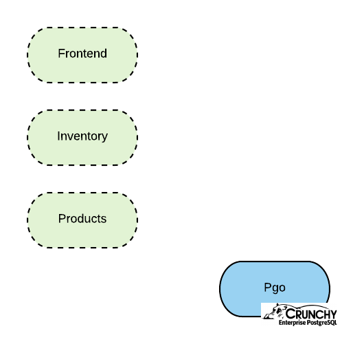
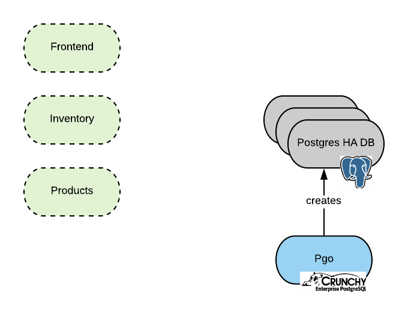
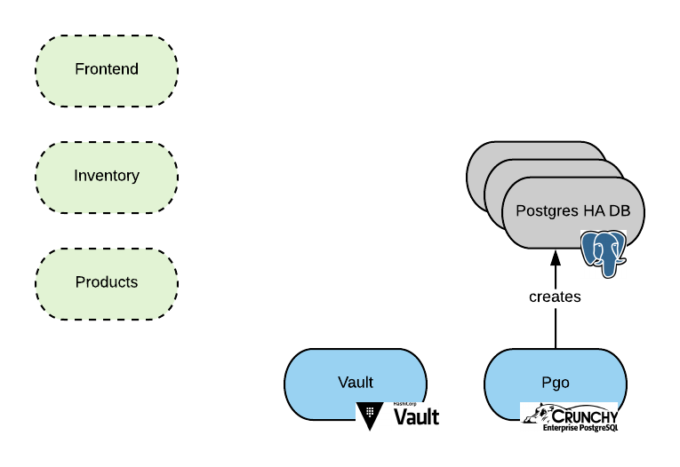
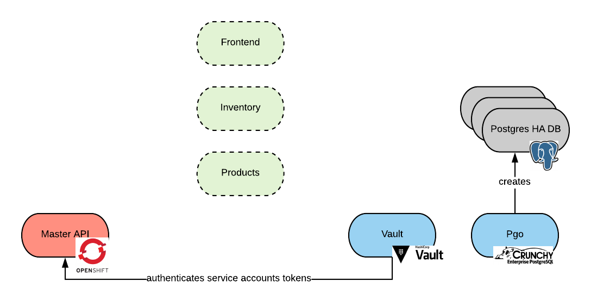
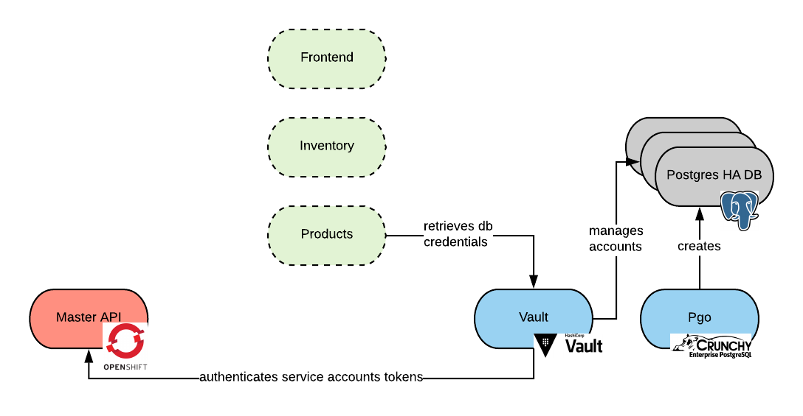
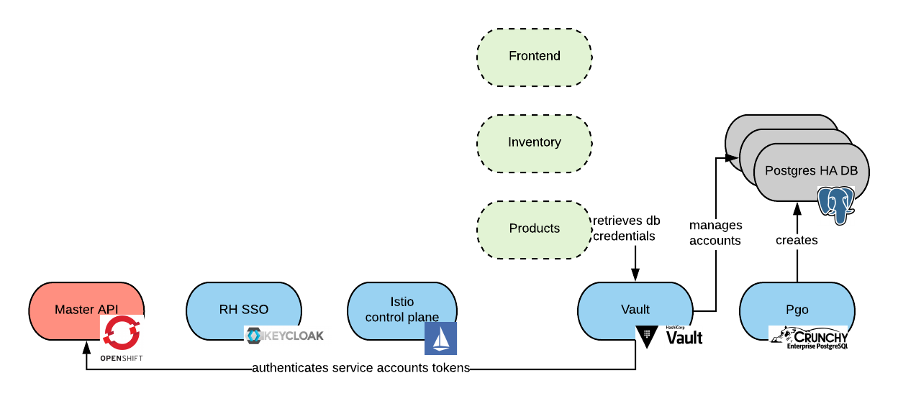
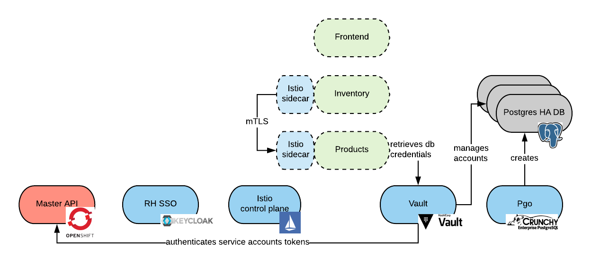
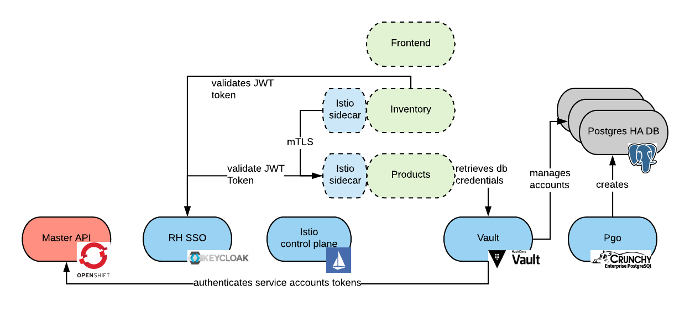
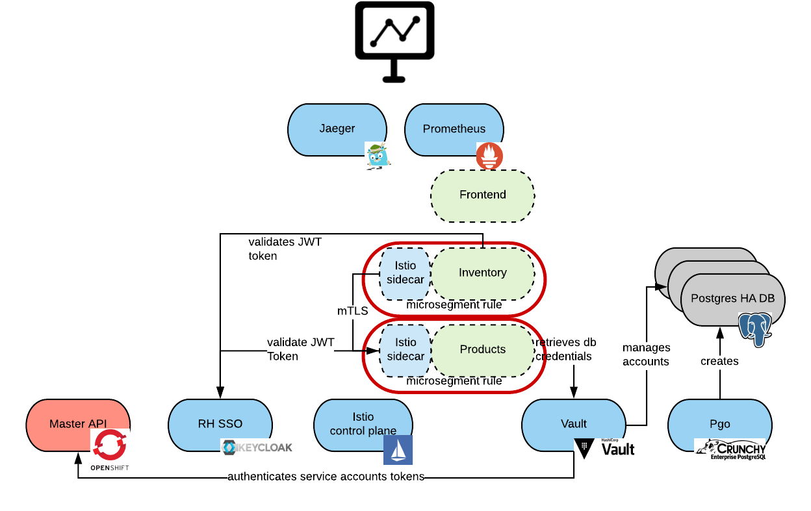
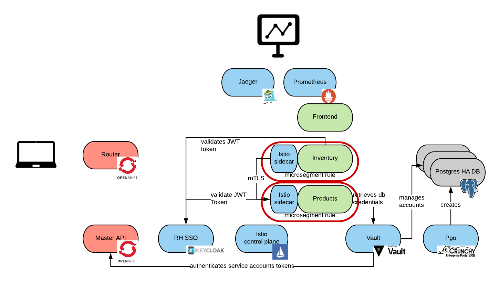

# Container Native Microservices with OpenShift Sample Application

This tutorial shows the steps to install and run a Spring Boot microservice with PostgreSQL in a container-native way. 

This sample application is comprised of:

* Spring Boot 1.5 with RHOAR for microservices *(In Progress)*
* Red Hat SSO 7.1 (a.k.a. Keycloak 2.5.5) for user management, authentication with JWT
  * Scalable, High Availability configuration using Kube Ping
  * Persistence with PostgreSQL
  * Pre-configured Realms for quick setup *(TODO)*
* Istio 0.4 (latest) for service mesh and security *(In Progress)*
  * Injection of Envoy/Istio sidecar proxy into microservice pod
  * Authorization of web service access via JWT and SSO with Istio Mixer rule
  * Mutual TLS
* Microsegmentation Rules (TODO)
* Prometheus (Istio Integration)
* Zipkin (Istio Integration)
* Grafana (Istio Integration)
* Service Graph (Istio Integration)
* Hashicorp Vault for managing secrets *(In Progress)*
* Crunchy Operator for High Availability PostgreSQL *(In Progress)*

The application has the following architecture:


## Assumptions:
1. You have an OpenShift Container Platform cluster >= 3.7
2. You have dynamic volume provisioning available
   * This is available by default with Minishift and `oc cluster up`
3. You are running the network policy plugin.
   * To enable the network policy plugin on Minishift use:
   ```  ./minishift openshift config set --patch='{"networkConfig":{"networkPluginName":"redhat/openshift-ovs-networkpolicy"}} ```
4. It's possible to use static provisioning provided that you have enough volumes

Here are the steps for the installation:

| Step | Architcture
|:-:|:-:|
| 1. [Deploy the Crunchy Postgres operator](./crunchy/deploy-cruncy.md) |  |
| 2. [Deploy Postgres in HA](./crunchy/deploy-HA-db.md) |  |
| 3. [Deploy Hashicorp Vault](./vault/deploy-vault.md) |  |
| 4. [Configure Vault to use Kubernetes backend authentication](./vault/vault-kube-backend.md) |  |
| 5. [Configure Vault to manage the postgresql DB](./vault/vault-postgres.md) |  |
| 6. [Configure application to use Vault to retrieve the postgresql account](./spring/accessing_pg.md) |  |
| 7. [RH SSO installation](./sso/README.md) |  |
| 8. [Istio core installation](./istio/README.md) |  | 
| 9. [Configure app to use Istio](./spring/adding_istio_sidecar.md) |  |
| 10. [Configure Istio to do Mutual TLS authentication](./istio/enabling-tls.md) |  |
| 11. [Configure istio to do OAuth Authentication via RH SSO](./istio/enabling-sso.md) |  |
| 12. [Istio Add-ons installation (prometheus, Jaeger)](./istio/addons.md) |  |
| 13. Configure microsegmentation |  |
| 14. [Build and deploy the application](./spring/README.md) |  |


# POC Outcome (as of 2/1/2018)

| technology | production ready | comments |
|:-:|:-:|:-:|
| RHOAR | yes | the maven plugin may not be fitting for all use cases |
| HA database running in openshift | yes | - HA templates to be developed with the customer - day 2 operations still not container native |
| postgres operator | no | main reason: lack of integration with enterprise security, it's in the roadmap to solve this |
| Vault | yes | |
| RH SSO | yes |  |
| istio | no | privileged scc permission needs to be given to all pods running in the mesh |
| Application managed OAuth | yes | | 
| Istio managed OAuth | no | seems a very frail configuration at this point, future versions of Istio may solve this issue |
| Istio managed mTLS | yes | more testing required |
| microsegmentation | N/A | not completed at this point |
