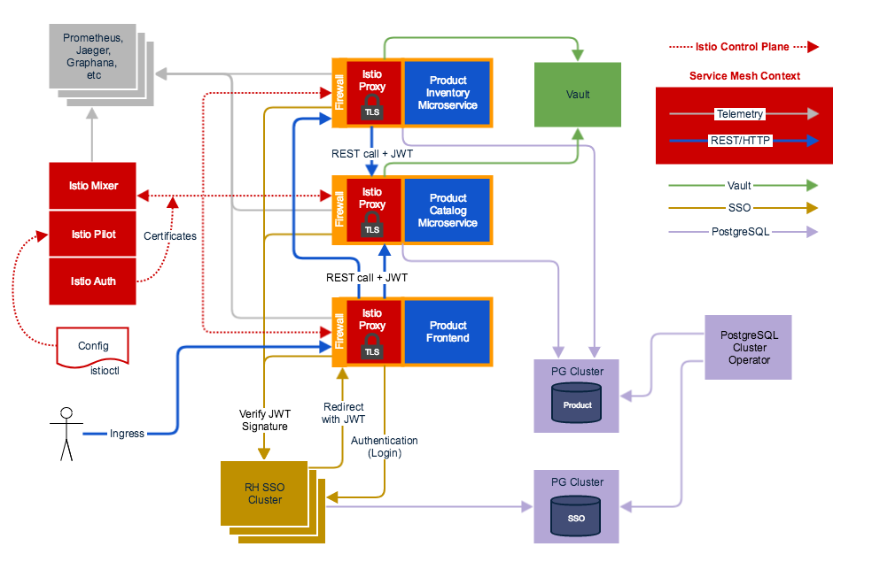

# Container Native Microservices with OpenShift Sample Application

This tutorial shows the steps to install and run a Spring Boot microservice with PostgreSQL in a container-native way. 

This sample application is comprised of:

* Spring Boot 1.5 with RHOAR for microservices *(In Progress)*
* Red Hat SSO 7.1 (a.k.a. Keycloak 2.5.5) for user management, authentication with JWT
  * Scalable, High Availability configuration using Kube Ping
  * Persistence with PostgreSQL
  * Pre-configured Realms for quick setup *(TODO)*
* Istio 0.4 (latest) for service mesh and security *(In Progress)*
  * Injection of Envoy/Istio sidecar proxy into microservice pod
  * Authorization of web service access via JWT and SSO with Istio Mixer rule
  * Mutual TLS
* Microsegmentation Rules (TODO)
* Prometheus (Istio Integration)
* Zipkin (Istio Integration)
* Grafana (Istio Integration)
* Service Graph (Istio Integration)
* Hashicorp Vault for managing secrets *(In Progress)*
* Crunchy Operator for High Availability PostgreSQL *(In Progress)*

The application has the following architecture:

## Assumptions:
1. You have an OpenShift Container Platform cluster >= 3.7
2. You have dynamic volume provisioning available
   * This is available by default with Minishift and `oc cluster up`
3. You are running the network policy plugin.

Here are the steps for the installation:

<<<<<<< HEAD
1. [Deploy the Crunchy Postgres operator](./crunchy/deploy-crunchy.md)
2. [Deploy Postgres in HA](./crunchy/deploy-HA-db.md)
3. [Deploy Hashicorp Vault](./vault/deploy-vault.md)
4. [Configure Vault to use Kubernetes backend authentication](./vault/vault-kube-backend.md)
5. [Configure Vault to manage the postgresql DB](./vault/vault-postgres.md)
6. Configure application to use Vault to retrieve the postgresql account
7. [RH SSO installation](./sso/README.md)
8. [Istio core installation](./istio/README.md)
9. Configure app to use Istio
10. Configure Istio to do Mutual TLS authentication
11. Configure istio to do OAuth Authentication via RH SSO
12. [Istio Add-ons installation (prometheus, Jaeger)](./istio/README.md)
13. Configure microsegmentation
14. [Build and deploy the application](./spring/README.md)
=======
1. [Build and deploy the application](./spring/README.md)
2. [Deploy the Crunchy Postgres operator](./crunchy/deploy-crunchy.md)
3. [Deploy Postgres in HA](./crunchy/deploy-HA-db.md)
4. [Deploy Hashicorp Vault](./vault/deploy-vault.md)
5. [Configure Vault to use Kubernetes backend authentication](./vault/vault-kube-backend.md)
6. [Configure Vault to manage the postgresql DB](./vault/vault-postgres.md)
7. Configure application to use Vault to retrieve the postgresql account
8. [RH SSO installation](./sso/README.md)
9. [Istio core installation](./istio/README.md)
10. Configure app to use Istio
11. Configure Istio to do Mutual TLS authentication
12. Configure istio to do OAuth Authentication via RH SSO
13. [Istio Add-ons installation (prometheus, Jaeger)](./istio/addons.md)
14. Configure microsegmentation
>>>>>>> 708150aefaf9449897597f58088492cdbe4d67a4
